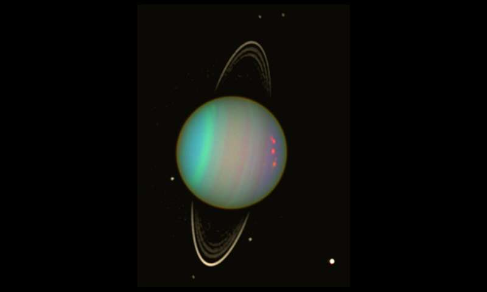
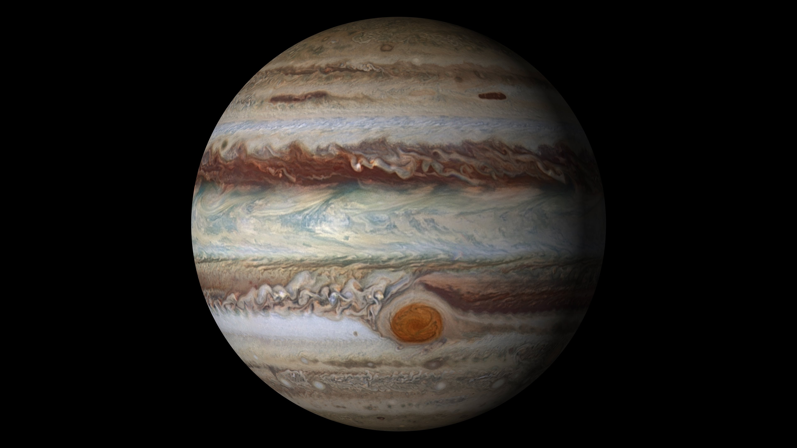

#photos {
    /* Prevent vertical gaps */
    line-height: 0;

    -webkit-column-count: 3;
    -webkit-column-gap: 0px;
    -moz-column-count: 3;
    -moz-column-gap: 0px;
    column-count: 3;
    column-gap: 0px;
}

#photos img {    
    width: 100% !important;
    height: 33% !important;
}

@media (max-width: 1500px) {
    #photos {
        -moz-column-count: 3;
        -webkit-column-count: 3;
        column-count: 3;
    }
}

/* set columns to two on screens 950px wide or less*/
@media (max-width: 950px) {
    #photos {
        -moz-column-count: 2;
        -webkit-column-count: 2;
        column-count: 2;
    }
}

/* set columns to one on screens 550px wide or less*/
@media (max-width: 550px) {
    #photos {
        -moz-column-count: 1;
        -webkit-column-count: 1;
        column-count: 1;
    }
}

/* class for second rendering of planet picture */
.second-render {
    margin-top: 100px;
}

<section id="photos">
                  
            
            
            
            
            
            
                  
            
        </section>`;