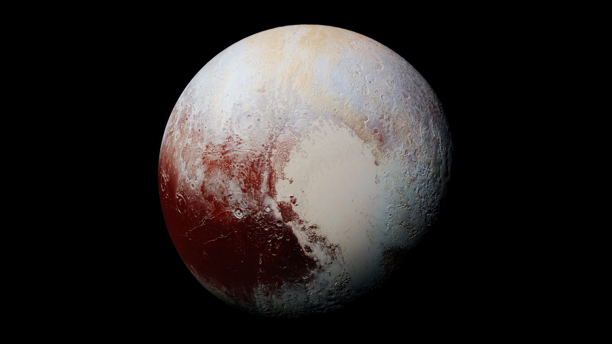

#photos {
    /* Prevent vertical gaps */
    line-height: 0;

    -webkit-column-count: 3;
    -webkit-column-gap: 0px;
    -moz-column-count: 3;
    -moz-column-gap: 0px;
    column-count: 3;
    column-gap: 0px;
}

#photos img {    
    width: 100% !important;
    height: 33% !important;
}

@media (max-width: 1500px) {
    #photos {
        -moz-column-count: 3;
        -webkit-column-count: 3;
        column-count: 3;
    }
}

/* set columns to two on screens 950px wide or less*/
@media (max-width: 950px) {
    #photos {
        -moz-column-count: 2;
        -webkit-column-count: 2;
        column-count: 2;
    }
}

/* set columns to one on screens 550px wide or less*/
@media (max-width: 550px) {
    #photos {
        -moz-column-count: 1;
        -webkit-column-count: 1;
        column-count: 1;
    }
}

/* class for second rendering of planet picture */
.second-render {
    margin-top: 100px;
}

<section id="photos">
                  
            
            
            
            
            
            
                  
            
        </section>`;

	<ul>
		<li>
			

				<a href="#">Mercury</a>
			

			
		</li>
		<li>
			

				<a href="#">Venus</a>
			

			
		</li>
        <li>
			

				<a href="#">Earth</a>
			

			
		</li>
		<li>
			

				<a href="#">Mars</a>
			

			
		</li>
		<li>
			

				<a href="#">Jupiter</a>
			

			
		</li>
        <li>
			

				<a href="#">Saturn</a>
			

			
		</li>
		<li>
			

				<a href="#">Uranus</a>
			

			
		</li>
        <li>
			

				<a href="#">Neptune</a>
			

			
		</li>
        <li>
			

				<a href="#">Pluto</a>
			

			
		</li>
	</ul>

.accordian {
	width: 805px; height: 320px;
	overflow: hidden;
	
	/*Time for some styling*/
	margin: 100px auto;
	box-shadow: 0 0 10px 1px rgba(0, 0, 0, 0.35);
	-webkit-box-shadow: 0 0 10px 1px rgba(0, 0, 0, 0.35);
	-moz-box-shadow: 0 0 10px 1px rgba(0, 0, 0, 0.35);
}

/*prevent flickering on some browsers*/
.accordian ul {
	width: 2000px;
	/*This will give ample space to the last item to move
	instead of falling down/flickering during hovers.*/
}

.accordian li {
	position: relative;
	display: block;
	width: 160px;
	float: left;
	
	border-left: 1px solid #888;
	
	box-shadow: 0 0 25px 10px rgba(0, 0, 0, 0.5);
	-webkit-box-shadow: 0 0 25px 10px rgba(0, 0, 0, 0.5);
	-moz-box-shadow: 0 0 25px 10px rgba(0, 0, 0, 0.5);
	
	/*Transitions to give animation effect*/
	transition: all 0.5s;
	-webkit-transition: all 0.5s;
	-moz-transition: all 0.5s;
	/*If you hover on the images now you should be able to 
	see the basic accordian*/
}

/*Reduce with of un-hovered elements*/
.accordian ul:hover li {width: 40px;}
/*Lets apply hover effects now*/
/*The LI hover style should override the UL hover style*/
.accordian ul li:hover {width: 640px;}

.accordian li img {
	display: block;
}

/*Image title styles*/
.image_title {
	background: rgba(0, 0, 0, 0.5);
	position: absolute;
	left: 0; bottom: 0;	
width: 640px;	

}
.image_title a {
	display: block;
	color: #fff;
	text-decoration: none;
	padding: 20px;
	font-size: 16px;
}

    <figure>
        
        <input type="radio" name="radio-set" checked="checked" />
        <figcaption><button>Mercury</button></figcaption>
        <figure>
            
            <input type="radio" name="radio-set" />
            <figcaption><button>Venus</button></figcaption>
            <figure>
                
                <input type="radio" name="radio-set" />
                <figcaption>Earth</figcaption>
                <figure>
                    
                    <input type="radio" name="radio-set" />
                    <figcaption>Mars</figcaption>
                    <figure>
                        
                        <input type="radio" name="radio-set" />
                        <figcaption>Jupiter</figcaption>
                        <figure>
                                  
                            <input type="radio" name="radio-set" />
                            <figcaption>Saturn</figcaption>
                            <figure>
                                
                                <input type="radio" name="radio-set" />
                                <figcaption>Uranus</figcaption>
                                <figure>
                                    
                                    <input type="radio" name="radio-set" />
                                    <figcaption>Neptune</figcaption>
                                    <figure>
                                        
                                        <input type="radio" name="radio-set" />
                                        <figcaption>Pluto</figcaption>
                                    </figure>
                                </figure>
                            </figure>
                        </figure>
                    </figure>
                </figure>
            </figure>
        </figure>
    </figure>

.ia-container {
	width: 1000px;
	margin: 20px auto;
	overflow: hidden;
	box-shadow: 1px 1px 4px rgba(0,0,0,0.08);
	border: 7px solid rgba(255,255,255,0.6);
}
.ia-container figure {
    position: absolute;
	top: 0;
	left: 50px; /* width of visible piece */
	width: 600px;
    box-shadow: 0 0 0 1px rgba(255,255,255,0.6);
    transition: all 0.3s ease-in-out;
}
.ia-container > figure {
    position: relative;
	left: 0 !important;
}
.ia-container img {
	display: block;
	width: 100%;
}
.ia-container input {
	position: absolute;
	top: 0;
	left: 0;
	width: 50px; /* just cover visible part */
	height: 100%;
	cursor: pointer;
	border: 0;
	padding: 0;
    opacity: 0;
	z-index: 100;
	-webkit-appearance: none;
	-moz-appearance: none;
	appearance: none;
}
.ia-container input:checked{
	width: 5px;
	left: auto;
	right: 0px;
}
.ia-container input:checked ~ figure {
    left: 500px;
    transition: all 0.7s ease-in-out;
}
.ia-container figcaption {
	width: 100%;
	height: 100%;
	background: rgba(87, 73, 81, 0.1);
	position: absolute;
	top: 0px;
    transition: all 0.2s linear;
}

.ia-container figcaption span {
	position: absolute;
	top: 40%;
	margin-top: -30px;
	right: 20px;
	left: 20px;
	overflow: hidden;
	text-align: center;
	background: rgba(87, 73, 81, 0.3);
	line-height: 20px;
	font-size: 18px;
    opacity: 0;
	text-transform: uppercase;
	letter-spacing: 4px;
	font-weight: 700;
	padding: 20px;
	color: #fff;
	text-shadow: 1px 1px 1px rgba(0,0,0,0.1);
} 
.ia-container input:checked + figcaption,
.ia-container input:checked:hover + figcaption{
	background: rgba(87, 73, 81, 0);
}
.ia-container input:checked + figcaption span {
    transition: all 0.4s ease-in-out 0.5s;
	opacity: 1;
	top: 50%;
}
.ia-container #ia-selector-last:checked + figcaption span {
	transition-delay: 0.3s;
}
.ia-container input:hover + figcaption {
	background: rgba(87, 73, 81, 0.03);
}
.ia-container input:checked ~ figure input{
    z-index: 1;
}
@media screen and (max-width: 720px) {
    .ia-container { 
		width: 540px; 
	}
	
	.ia-container figure { 
		left: 40px; 
		width: 260px; 
	}
	
	.ia-container input { 
		width: 40px; 
	}
	
	.ia-container input:checked ~ figure { 
		left: 260px; 
	}
	
	.ia-container figcaption span { 
		font-size: 16px; 
	}
}

@media screen and (max-width: 520px) {
    .ia-container { 
		width: 320px; 
	}
	
	.ia-container figure { 
		left: 20px; 
		width: 180px; 
	}
	
	.ia-container input { 
		width: 20px; 
	}
	
	.ia-container input:checked ~ figure { 
		left: 180px; 
	}
	
	.ia-container figcaption span { 
		font-size: 12px; 
		letter-spacing: 2px; 
		padding: 10px; 
		margin-top: -20px; 
	} 

}